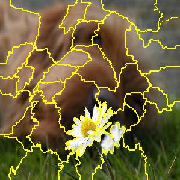
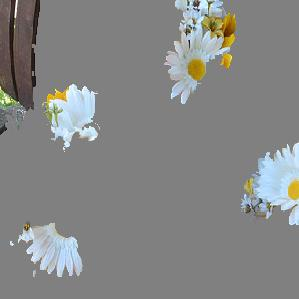

# STREAK Example Code

Interpreting neural networks via the STREAK algorithm (streaming weak submodular maximization).

- Ethan R. Elenberg, Alexandros G. Dimakis, Moran Feldman, and Amin Karbasi. ‘‘Streaming Weak Submodularity: Interpreting Neural Networks on the Fly’’, to appear in *Proc. Neural Information Processing Systems (NIPS)*, 2017. 
[arXiv (preprint)](https://arxiv.org/abs/1703.02647)

### Example

|  |  | |
|:---:|:---:|:---:|
| Original Image (top label: daisy) | Segmented Image | Interpretation for daisy|

|  |  | |
|:---:|:---:|:---:|
| Original Image (top label: daisy) | Segmented Image | Interpretation for daisy|

Given a black-box neural network and a test image, the algorithm finds a sparse explaination for the network's prediction. First, segment the image into regions. Then rerun the network with most of the image regions replaced by a gray reference image, and record the output. The algorithm returns a sparse set of regions that collectively still activate the network's top label. These examples use InceptionV3 with the last layer retrained to classify different types of flowers.

### Requirements

- Directory 'retrained' that contains the black box models
	
	-- bottleneck\_fc\_model.h5 (keras)

	-- classify\_image\_graph\_def.pb and output\_labels.txt (tensorflow)
	 
- Directory 'sunflowers' that contains jpeg images from class sunflowers to use as queries

- Directory 'daisy' that contains jpeg images from class daisy to use as queries

- Directory 'outputs' to save the output images

- LIME, TensorFlow and/or Keras, NumPy, scikit-image, and joblib packages

### Usage

 The main scripts are [streakInterpretationExample.py](./streakInterpretationExample.py) and [streakRegressionExample.py](./streakRegressionExample.py). The Jupyter notebook [StreakImageRetraining.ipynb](./StreakImageRetraining.ipynb) is also available as a convenient walkthrough of streakIntrepretationExample. [tf_predict.py](./tf_predict.py) can also be used from the command line to load the tensorflow model and predict labels for a list of images.

```sh
python streakInterpretationExample.py image1.jpg image2.jpg
python streakRegressionExample.py
python tf_predict.py image1.jpg image2.jpg
```
A modified LimeImageExplainer class supports 2 new feature selection methods:

- 'greedy_likelihood' (STREAK Likelihood) is the method described in Section 6.2 of the paper. It does not require generating a set of perturbed images, which leads to faster running times for moderate number of image segments.

- 'streaming\_greedy' (STREAK LIME) is the method described in Section A.8 of the paper. It generates perturbed images but then uses STREAK as the feature selection method instead of forward selection, highest weights, lasso, etc. Like LIME, it scales with the number of perturbed images. Running time is consistently shorter than 'forward\_selection' and longer than 'highest\_weights'.
